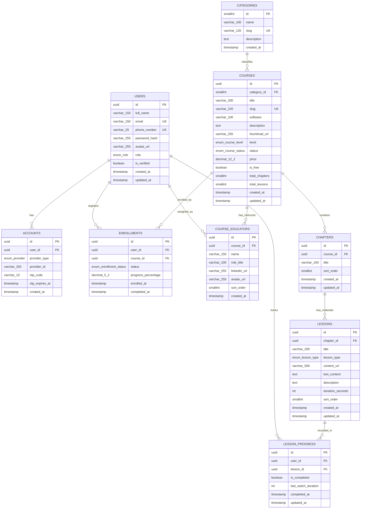

# Database Design & Entity Relationship Diagram (ERD) - Edu Course (LMS SMK DKV)

## 1. Diagram ERD (Mermaid)

## 2. Naming Convention & Data Types

- **Naming Convention**: `snake_case` konsisten untuk nama tabel, kolom, constraint, dan relasi, menyesuaikan dengan standar SQL.
- **Primary Keys**: `id` umumnya bertipe `UUID` untuk entitas utama (agar lebih aman dari enumeration dan memudahkan scaling), sedangkan untuk tabel referensi ringan (seperti `CATEGORIES`) bisa menggunakan `SMALLINT`.
- **Enums**: Menggunakan ENUM pada PostgreSQL atau field terpisah untuk merepresentasikan nilai statis terbatas (seperti `enum_role`, `enum_provider`, `enum_course_level`, `enum_course_status`, `enum_lesson_type`, `enum_enrollment_status`).
- **Data Limits**: Ada batasan presisi yang terdefinisi seperti `varchar_150`, `varchar_200`, `decimal_12_2` untuk optimasi ruang penyimpanan database (sesuai spesifikasi di Mermaid).
- **Audit Trails**: Setiap tabel menyediakan `created_at` (dan sebagian besar dengan `updated_at`) berformat TIMESTAMP.

## 3. Strategi Indexing

| Tabel | Jenis Index | Kolom yang di Index | Alasan / Tujuan |
|---|---|---|---|
| `USERS` | Single Index (Unique) | `email`, `phone_number` | Akses cepat login, verifikasi pengguna, serta menghindari data ganda. |
| `CATEGORIES` | Single Index (Unique) | `slug` | Optimalisasi *routing* FE saat navigasi per kategori (SEO friendly). |
| `COURSES` | Single Index (Unique) | `slug` | Mempercepat *look-up* detail course via URL. |
| `COURSES` | Single Index | `category_id` | Menampilkan course di FE berdasarkan kategori secara cepat. |
| `COURSES` | Composite Index | `(category_id, status)` | Mempercepat load data saat filtering page/beranda course dengan status tertentu. |
| `CHAPTERS` | Composite Index | `(course_id, sort_order)` | Agar *sorting* list modul / chapter pada detail course ringan. |
| `LESSONS` | Composite Index | `(chapter_id, sort_order)` | Agar video player dan silabus di FE berjalan urut dengan cepat. |
| `ENROLLMENTS` | Composite Index (Unique) | `(user_id, course_id)` | Satu user tidak bisa *enroll* ke course yang sama berulang kali, membantu mempercepat load list "My Course". |
| `LESSON_PROGRESS` | Composite Index (Unique) | `(user_id, lesson_id)` | Menyimpan track/state progress video secara unik per user dan lesson-nya. |
